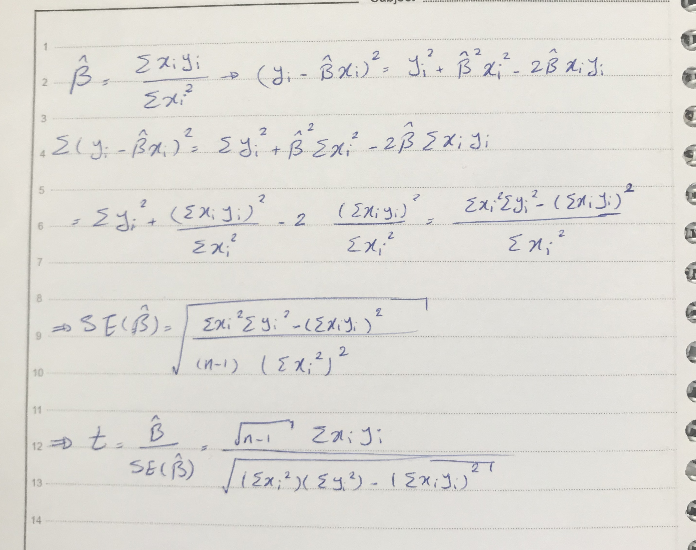

preparation

```{r}
set.seed (1)
x=rnorm(100)
y=2*x+rnorm(100)
```

a
```{r}
lm_a=lm(y~x+0)
summary(lm_a)

```

b
```{r}
lm_b=lm(x~y+0)
summary(lm_b)

```
c

t value of both models are same but there is no relation between two coefficients

d



```{r}
c(summary(lm_a)$coefficients[,"t value"],summary(lm_b)$coefficients[,"t value"])
```

e

the equation is symmetric for x and y so changing x and y will not affect the result.


f
```{r}
lm_fyx=lm(y~x)
lm_fxy=lm(x~y)
c(summary(lm_fyx)$coefficients[2,"t value"],summary(lm_fxy)$coefficients[2,"t value"])
```

